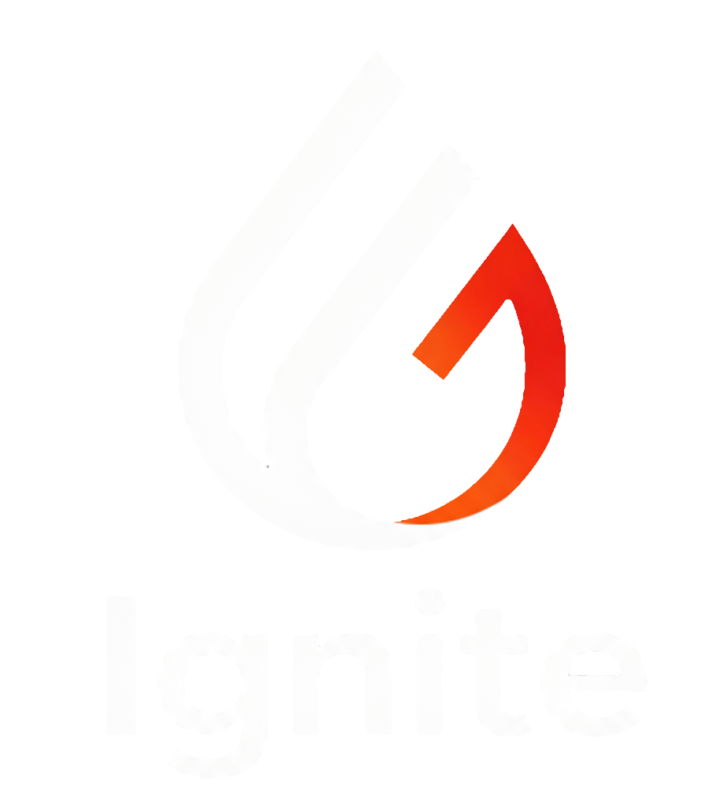

## Ignite 
O projeto Ignite propõe ser uma concessionária online onde diferentes marcas podem se conectar com seus clientes através de uma experiência de compra unificada.
A proposta central do projeto é facilitar a venda de veículos de diferentes marcas e também lidar com a dificuldade de clientes que moram em cidades mais remotas a terem acesso a compra desses veículos por não possuírem representantes oficiais de determinadas marcas na região.

## Sobre o projeto
O projeto foi desenvolvido de forma coletiva com o objetivo de desenvolver uma plataforma capaz de centralizar a venda de diversas marcas e oferecer uma melhor experiência ao cliente.
O projeto contém funcionalidades para o gerenciamento de contas, compra de produtos, comunicação via e-mail e atualização de dados pessoais.

## funcionalidades
- Cadastro de usuários
- Login 
- Alteração de informações pessoais
- Catálogo de produtos
- Sistema de compras
- Envio de E-mails automáticos
- sistema de comunicação com a empresa via e-mail

### Stacks

- PHP
- Laravel
- JavaScript
- Vite
- TailwindCSS
- HTML
- MySQL
  

## Instalação e Execução do projeto
Atualmente o projeto não está hospedado, para executar localmente é preciso possuir PHP, Composer, Node.js e MySQL instalados.
Após ser clonado o projeto e instalado os requisitos, execute no terminal:
- composer install
- npm install
- npm run dev
- php artisan serve

## Projeto acadêmico
O ignite foi desenvolvido como um projeto acadêmico em grupo.
